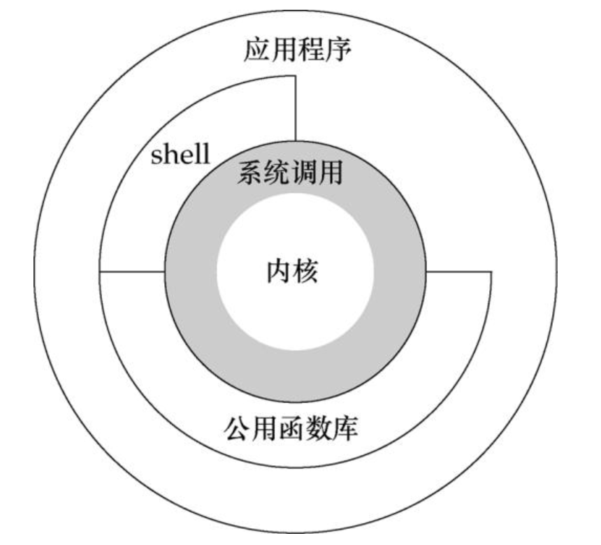
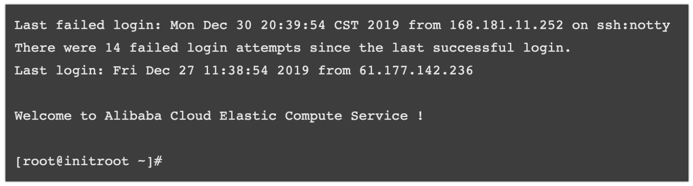

# Linux 基础操作


## 一、概述
### 什么是 Linux
Linux，通常被认为是一套操作系统，实际上它**是一系列 Linux 内核基础上开发的操作系统的总称**。日常所见比较多的 Ubuntu、企业常用的 centos 其实都是 Linux 系统，包括我国自己的中标麒麟系统其实也是基于 Linux 内核搞出来的，都可以视为 Linux 系统大家族的成员。

### Linux 的诞生

Linux 最开始是由芬兰赫尔辛基大学学生林纳斯·托瓦兹（Linus Torvalds）于 1991 年开发。


由于 unix 操作系统的商业版权问题，Linus Torvalds 希望在 intelx86 cpu 上可以运行自由版本的类 UNIX 操作系统，出于个人爱好尝试开发了 Linux 操作系统内核。

随着互联网的快速发展，Linux 内核得到了来自全世界软件爱好者、组织以及公司的广泛支持。

在服务器、个人电脑、嵌入式系统等领域得到了广泛的应用。

目前的 Linux 同时支持 32 位和 64 位硬件。

### Linux 的组成部分
第一个是 Linux 内核。内核是操作系统的核心，具有很多最基本功能，如虚拟内存、多任务、共享库、需求加载、可执行程序和 TCP/IP 网络功能。Linux 内核的模块分为以下几个部分：存储管理、CPU和进程管理、文件系统、设备管理和驱动、网络通信，以及系统的初始化（引导）、系统调用等。<br />
<br />第二个是 Linux 的文件系统。文件系统是文件存放在磁盘等存储设备上的组织方法。Linux 系统能支持多种目前流行的文件系统。<br />
<br />第三个是 Shell。Shell 是系统的用户界面，提供了用户与内核进行交互操作的一种接口。它接收用户输入的命令并把它送入内核去执行，是一个命令解释器。另外，Shell 编程语言具有普通编程语言的很多特点，用这种编程语言编写的 Shell 程序与其他应用程序具有同样的效果。


<br />当然很多人的 Linux 系统上也要装很多应用程序，这些东西组合在一起，就成为一个可以使用的 Linux 操作系统了。

## 二、命令行
Shell（也称为终端或壳）充当的是人与内核（硬件）之间的翻译官，用户把一些命令“告诉”终端，它就会调用相应的程序服务去完成某些工作。Bash 是 Linux 系统的一种 Shell（命令行环境），是目前绝大多数 Linux 发行版的默认 Shell。

通过终端登陆 linux：

```
# -p 22 指定端口（默认端口22）
# root@192.168.66.141 指定账号 root 和服务器的 IP 为 192.168.66.141
ssh -p 22 root@192.168.66.141

yes

# 密码
root123
```



Linux 登陆成功后会启用启动 Bash 进程，Bash 就会显示自己的命令行提示符，如上面的最后一行所示，即为 Bash 的命令行提示符。此时用户就可以在命令行输入命令了。<br />
<br />进入命令行环境以后，一般就已经打开 Bash 了。如果你的 Shell 不是 Bash，可以输入 `bash` 命令启动 Bash。<br />

> tip：使用 `exit` 可以退出 bash。


### 命令提示符
Bash 会显示命令行提示符，提示用户输入命令。一般命令提示符的形式如下所示：
```bash
[用户名@计算机名 当前工作目录]$
```
$ 为普通用户命令默认的命令提示符。<br />系统管理员 root 默认的命令提示符为 #。

不同发行版的默认的命令行提示符会有一些差异，命令提示符的样式可以通过 `PS1` 变量进行设置。可以使用 `echo` 命令打印 `PS1` 的值
```bash
[heyi@heyideMacBook-Pro ~]$ echo $PS1
[\u@\h \W]\$ 
```
可以看到 PS1 变量中有很多转义字符，这些转义字符的含义如下所示：
```bash
\d :可显示出星期、月、日的日期格式,如:"Mon Feb 2"
\H :完整的主机名。例如本站的主机名为initroot.com
\h :仅取主机名在第一个小数点之前的名字,如本站主机名www.initroot.com，只取initroot，后面省略
\t :显示时间,为24小时格式的HH:MM:SS
\T :显示时间,为12小时格式的HH:MM:SS
\A :显示时间,为24小时格式的HH:MM
\@ :显示时间,为12小时格式的am/pm样式
\u :目前使用者的账号名称,如peter;
\v :BASH的版本信息,如本站主机中bash版本为4.2.46(1)-release,仅取4.2显示
\w :完整的工作目录名称,由根目录写起的目录名称。家目录以~取代;
\W :利用basename函数取得工作目录名称,所以仅会列出最后一个目录名。
\# :下达的第几个命令。
\$ :提示字符,如果是root,提示字符为#,否则就是$
```
可以通过给变量重新赋值的方式修改命令行提示符：
```bash
[heyi@heyideMacBook-Pro ~]$ PS1='[\u@\h \W \A]\$ '
[heyi@heyideMacBook-Pro ~ 11:59]$
```
`\A` 以 24 小时的 HH:MM 格式显示时间。<br />
<br />

## 三、linux 命令
linux 命令是指**在 linux 命令行模式下运行的可实现特定功能的一段计算机软件程序**。<br />例如 pwd 命令可以打印当前工作目录，cd 命令可以切换当前工作目录。<br />linux 命令通过终端 shell 命令行模式启动运行。

### 3.1 命令的基本结构
我们在前面已经接触过命令了，例如上面的 `echo $PS1` ，其中 `echo` 为命令名， `$PS1` 为命令参数。<br />通常 linux 命令的组成结构如下所示：
```
命令名command [选项options] [参数argument ...]
```
命令名、选项和参数中间以空格来区分。其中 option 是可选的，即有些命令是没有选项的，选项（也有人称之为参数，因为从编程的角度来说，它就是参数），选项是控制命令运行状态和行为的。argument 是参数，是命令要操作的文件、路径、数据等，也是可选的，因为有些命令不需要操作这些内容。<br />比如：
```bash
[heyi@heyideMacBook-Pro ~ 15:58]$ echo 'asd asdasd'
asd asdasd
[heyi@heyideMacBook-Pro ~ 15:58]$ echo -n 'asd asdasd'
asd asdasd[heyi@heyideMacBook-Pro ~ 15:58]$ 
```
选项 `-n` 表示不换行显示文本。<br />

> tips：linux 命令对大小写是敏感的。


### 3.2 命令回传值
若前一个命令执行的结果为正确，在 Linux 底下会回传一个 `$? = 0` 的值。
```bash
[heyi@heyideMacBook-Pro shell-demo 17:19]$ ls
dir001		dir003		dir005
dir002		dir004		time.txt
[heyi@heyideMacBook-Pro shell-demo 17:19]$ echo $?
0
```
如果 `$?` 不为 `0`，就代表上一个命令执行有误。<br />

### 3.3 同时执行多条命令
在某些时候，我们希望可以一次执行多个命令。比如进入某个目录，然后列出这个目录下的目录和文件列表。<br />我们可以通过  `;` 、`||`、 `&&` 这些特殊符合在命令行一次执行多条命令。<br />

#### 多条命令之间无关联
分号 `;` 前后的两个命令可以没有任何关联。
```bash
[heyi@heyideMacBook-Pro ~ 17:11]$ cd File/; ls
```
在命令与命令中间利用分号 `;` 来隔开，这样一来，分号前的指令执行完后就会立刻接着执行后面的命令了。<br />但是通过 `;` 来隔开的多个命令之间是没有关联的，即使 `cd File/` 执行失败，也会执行 `ls` 。
```bash
[heyi@heyideMacBook-Pro shell-demo 17:19]$ cd File/; ls
bash: cd: File/: No such file or directory
dir001		dir003		dir005
dir002		dir004		time.txt
```
如果希望执行 `cd File/` 失败就不执行 `ls` ，即需要判断多个命令之间的关联性，就需要使用 `&&` 和 `||` 符号。

#### 多条命令之间有关联
`&&` 或 `||` 会先判断前面的命令执行结果返回值 `$?` ，透过这个回传值来判断后续的指令是否要执行。
```bash
cmd1 && cmd2
```
说明：<br />

1. 若 cmd1 执行完毕且正确执行( `$?=0` )，则开始执行 cmd2。
1. 若 cmd1 执行完毕且为错误 ( `$?≠0` )，则 cmd2 不执行。


```bash
cmd1 || cmd2
```
说明：

1. 若 cmd1 执行完毕且正确执行( `$?=0` )，则 cmd2 不执行。
1. 若 cmd1 执行完毕且为错误 ( `$?≠0` )，则开始执行 cmd2。


### 3.4 命令的功能分类
linux 下的命令根据功能可以分为如下几大类：

- 用户管理命令
- 文件和目录管理命令
- 磁盘管理命令
- 进程管理命令
- 网络管理命令
- 系统管理命令


## 四、常用的命令
Linux命令大全：[man.linuxde.net/](https://link.juejin.im/?target=http%3A%2F%2Fman.linuxde.net%2F)<br />直接在命令行下输入 `help` 命令可以查看 bash 提供的所有内置命令。 `help command` 可以查看相应命令的说明信息。<br />

### 4.1 bc 计算器
我们可以利用命令行下的计算器，执行加减乘除运算：
```bash
[heyi@heyideMacBook-Pro ~ 16:00]$ bc
bc 1.06
Copyright 1991-1994, 1997, 1998, 2000 Free Software Foundation, Inc.
This is free software with ABSOLUTELY NO WARRANTY.
For details type `warranty'.
1+2
3
2*3
6
```
通过 `quit` 命令退出计算器。<br />

### 4.2 clear 清空终端屏幕
clear 命令用来清除终端屏幕，这个命令很简单，只需在命令行敲击 clear 并回车，屏幕即被清理干净，命令行提示符回到屏幕第一行。
> ctrl + l 也可以用来清除终端屏幕


<br />
<br />

### 4.3 目录操作的相关命令
和目录操作相关的命令有：

1. cd 命令：切换当前工作目录;
1. pwd 命令：显示当前工作目录;
1. mkdir 命令：创建新目录;
1. rmdir：删除空目录。

我们在执行和目录操作相关的命令的时候，总是会遇到一些特殊的符号，这些特殊的符号表示特殊的目录：

- . 表示当前目录;
- .. 表示上一层父目录;
- - 表示前一个工作目录;
- ~ 表示当前登录用户的家目录;


输出树形目录结构：

```
方法一
find . -print | sed -e 's;[^/]*/;|____;g;s;____|; |;g'
find . -print | sed -e 's;[^/]*/;|__ ;g;s;|__ |;    |;g' # 优化后

// 方法二
brew install tree
tree                         #打印所有目录层级
tree -L 2                    #遍历2层
tree > README.md             #输出结果到 Markdown 文档
```


### 4.4 文件操作的相关命令

#### touch 创建文件

touch 创建一个空白文件。<br />

#### 查看文件内容

##### cat 命令
cat 命令读取文件的内容并将内容连续（concatenate）输出到标准输出，用于查看文件的内容。cat是单词 concatenate 的简写。<br />如果没有加任何参数，cat 读取标准输入并输出到标准输出。
```bash
cat [选项option] 文件名称
```
常用选项：

- -n 显示行号
- -b 显示非空行行号

<br />
##### more/less 翻页查看
如果文本文件的行数太多，超过了一屏显示的行数，通过 cat 命令显示文件内容的话，就不是很方便了。这时候可以使用 more/less 命令一页一页的查看内容。<br />pageup-向上翻一页，pagedown-向下翻一页。空格键-向下翻一页。q-退出。

##### head：查看文件内容，只看头几行。
```bash
head -n 10 文件名称 # 只看前10行
```
##### tail：查看文件内容，从指定点开始将文件写到标准输出。

```bash
tail -n 5  文件名  	# 查看后5行
tail -f 文件名 	# 实时追踪该文档的所有更新
```


##### grep 过滤

在指定文件中查找字符（串）并打印该行
用法：grep 字符串 文件名
grep band file 在file文件中找寻band字符串


### 4.5 文件(包括目录)相关操作


#### ls 命令显示目录或者文件列表
ls 为 list 的缩写，用来列出文件或者目录信息列表。ls 命令的常用格式如下所示：
```bash
ls [选项option] 文件或目录名...
```
常用的选项主要有4个：

- -a：列出包括隐藏文件(.开头的文件)在内的全部文件。
- -d：仅列出目录本身，而不是列出目录内的文件。
- -l：显示文件的详细属性信息。
- -h :ls 默认以字节为单位显示文件大小，此选项可以将文件大小以 KB、MB、GB 等用户较易读的单位方式显示。


#### open 命令打开文件或目录
open 命令打开一个文件（或目录或URL），就像双击文件的图标。 如果未指定应用程序名称，则通过LaunchServices 确定的默认应用程序用于打开指定的文件。如果文件采用URL形式，则文件将作为URL打开。
```bash
open 文件或目录名称
open "http://baidu.com"
```


#### cp命令复制文件或者目录
cp 为 copy 的缩写，cp 命令主要用来复制文件和目录，常用的命令格式如下所示：
```bash
# 复制文件
cp [选项option] 来源文件(source ...) 目录(directory) 

# 复制目录
cp -r 目录(directory) 目录(directory)
```


#### rm 命令删除文件或目录
rm 为 remove 的缩写，该命令用来删除文件或者目录。常用命令格式如下：
```bash
rm [选项option] 文件或目录
```
选项：

- -f：为force的缩写，强制删除。忽略不存在的文件，不提示警告信息。
- -i：互动模式，在删除前会询问用户是否确认删除。
- -r：递归选项，常用来删除多级目录。

<br />

#### mv 命令移动文件或者目录（重命名文件或目录）

mv 为 move 的缩写，可以移动文件和目录，常用 mv 命令重命名一个文件或者目录，命令常用格式如下：
```bash
# 移动
mv [选项option] source destination
mv [选项option] source1 source2 source3 .... directory

# 重命名
mv 文件或目录 文件或目录的新名字
```
选项：

- -f：为 force 的缩写，强制移动。如果目标文件已经存在，直接覆盖掉已经存在的文件而不给出询问提示。
- -i：互动模式，若目标文件(destination)已经存在，会询问提示是否覆盖已存在文件。
- -r：若目标文件已经存在，且 source 源文件比目标文件新，才会覆盖更新(update)已存在的文件。


#### find 查找

用法：`find [路径] [选项]`
常用选项有：
`find . -name *.log`  在当前目录查找以 `.log` 结尾的文件
`find / -name log`  在根目录查找 `log` 命名的目录


### 4.6 压缩文件的操作命令

**1）打包并压缩文件**<br />Linux 中的打包文件一般是以 .tar 结尾的，压缩的命令一般是以 .gz 结尾的。<br />而一般情况下打包和压缩是一起进行的，打包并压缩后的文件的后缀名一般 .tar.gz。
```bash
tar -zcvf 打包压缩后的文件名 要打包压缩的文件
```
其中：

- z：调用gzip压缩命令进行压缩
- c：打包文件
- v：显示运行过程
- f：指定文件名

比如，test 目录下有三个文件分别是：aaa.txt、bbb.txt、ccc.txt，如果我们要打包 test 目录并指定压缩后的压缩包名称为 test.tar.gz。可以使用命令：
```bash
tar -zcvf test.tar.gz aaa.txt bbb.txt ccc.txt
tar -zcvf test.tar.gz ./test
```
**<br />**2）解压压缩包**
```bash
tar -xvf 压缩文件名称
```
其中：

- x：代表解压


<br />示例：<br />
<br />1、将 test.tar.gz 解压到当前目录下可以使用命令：
```bash
tar -xvf test.tar.gz
```
将 test.tar.gz 解压到指定目录下:
```bash
tar -xvf test.tar.gz -C 目录
```
`-C` 代表指定解压的位置。<br />
<br />


### 4.7 ｜管道符

在命令之间建立管道，将前面命令的输出作为后面命令的输入。
通过命令查找 tomcat 进程：ps -ef | grep tomcat
通过命令查找到占用此端口的进程编号：netstat -apn|grep 8080


### 4.8 下载服务器文件

下载服务器文件到当前目录：

```
scp root@192.168.20.115:/usr/share/nginx/html/reduce/index.html .
scp root@192.168.19.12:/home/zcloud-htdbaas-web-new/htdbaas_web_3.2.0.tar.gz .
```


上传当前文件到服务器目录

```
scp /home/zcloud/zcloud-web-dev/html.tar.gz root@172.16.60.87:/usr/share/nginx
```


## 五、服务器操作


启动服务

```
systemctl daemon-reload #重新加载配置

systemctl enable consul.service # 设置开机自启动

systemctl start consul # 启动服务

systemctl stop consul # 停止服务

systemctl status consul # 查看服务状态

```


df -h

查看磁盘占用的空间


## 参考

Linux工具快速教程：[https://linuxtools-rst.readthedocs.io/zh_CN/latest/index.html](https://linuxtools-rst.readthedocs.io/zh_CN/latest/index.html)<br />Linux 基础入门：https://www.initroot.com/linuxintroduction.html<br />鸟哥的Linux私房菜：[http://linux.vbird.org/linux_basic/](http://linux.vbird.org/linux_basic/)<br />Bash 脚本教程：[https://wangdoc.com/bash/](https://wangdoc.com/bash/)


